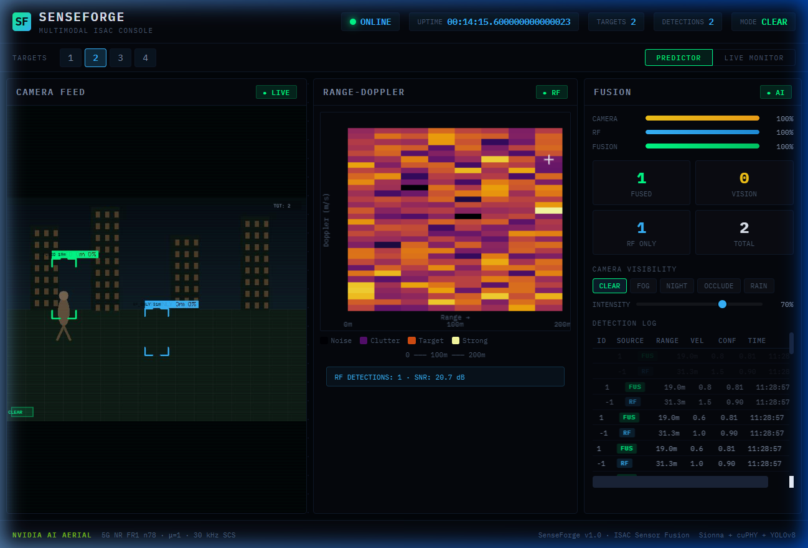
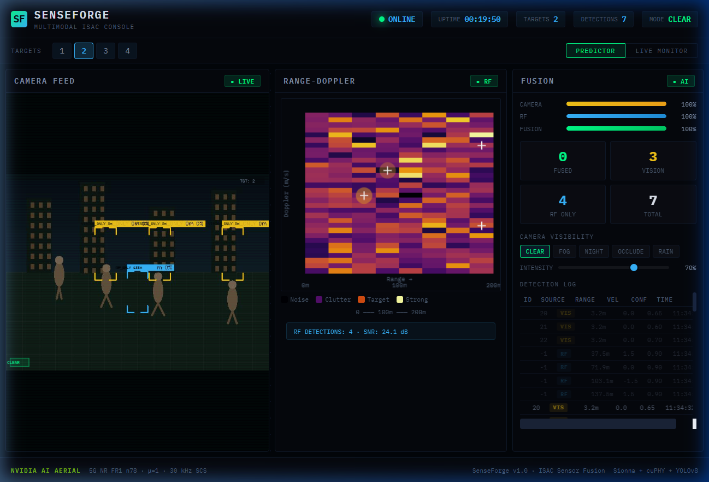
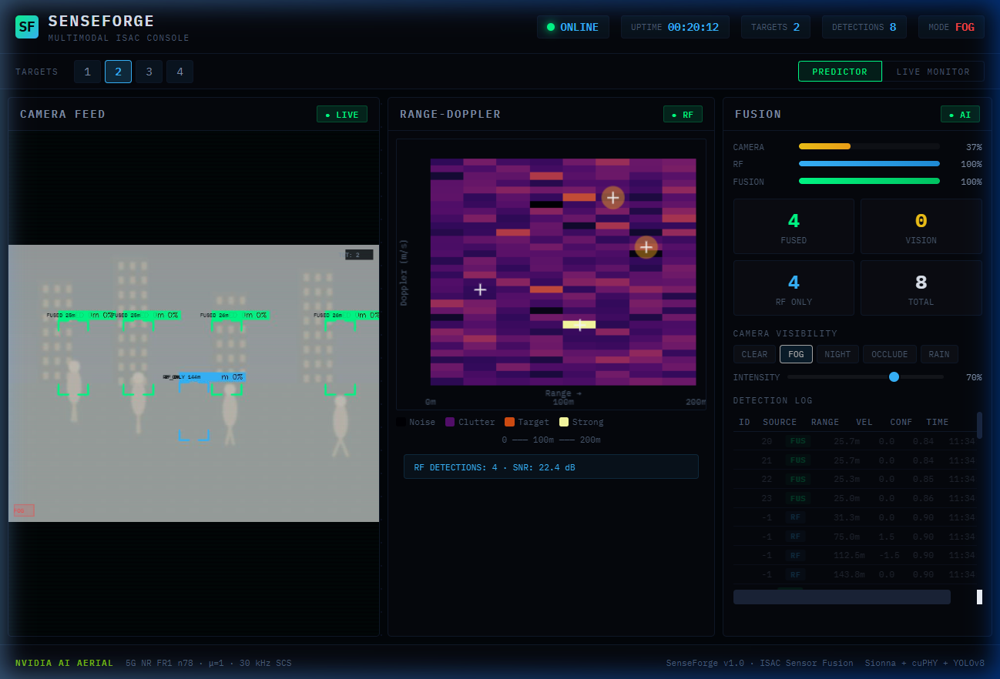
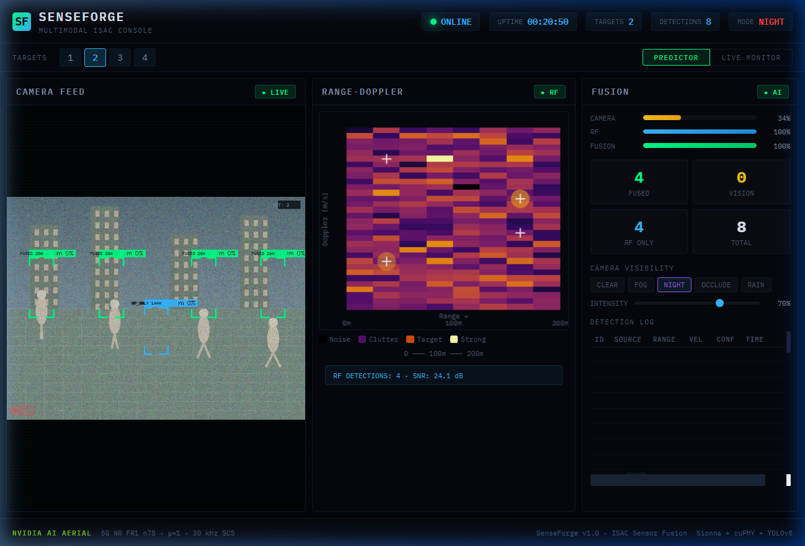
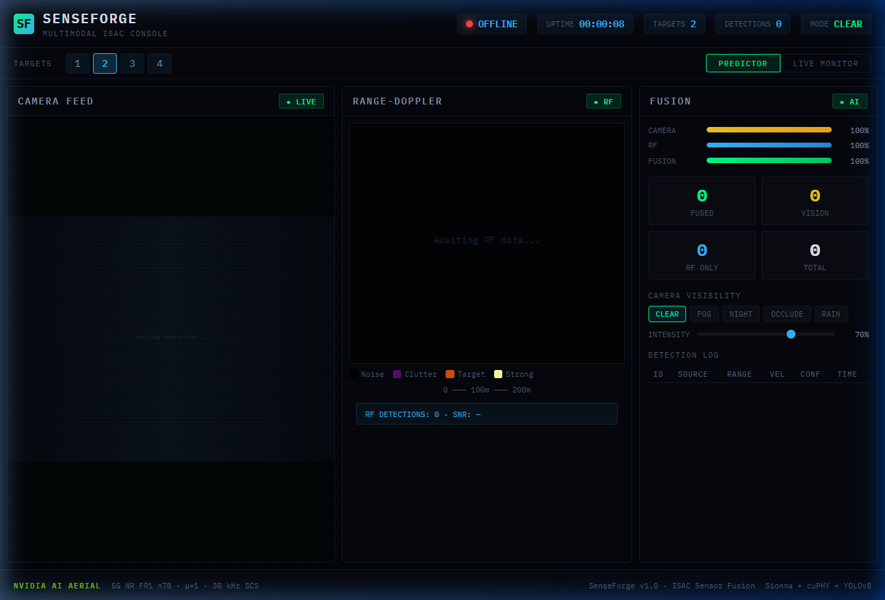
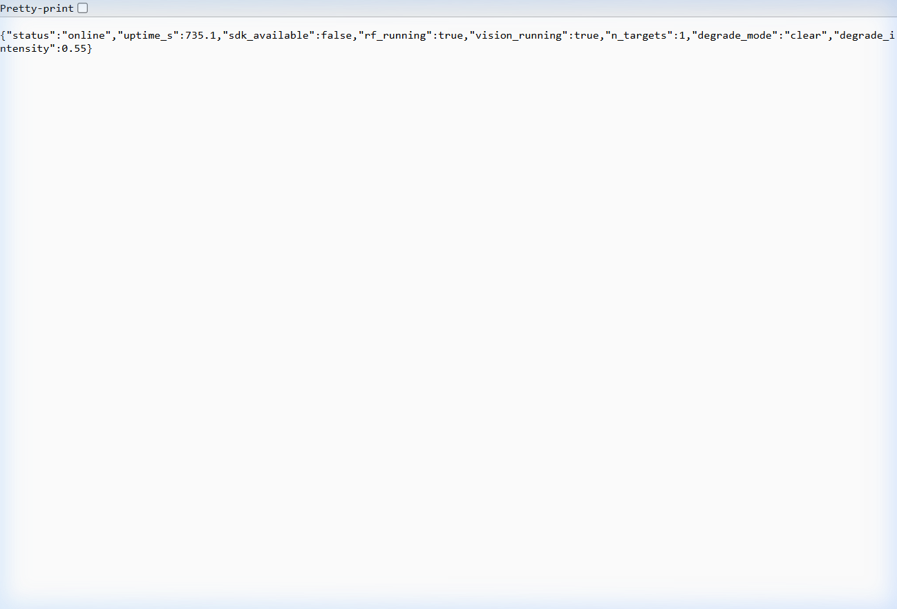
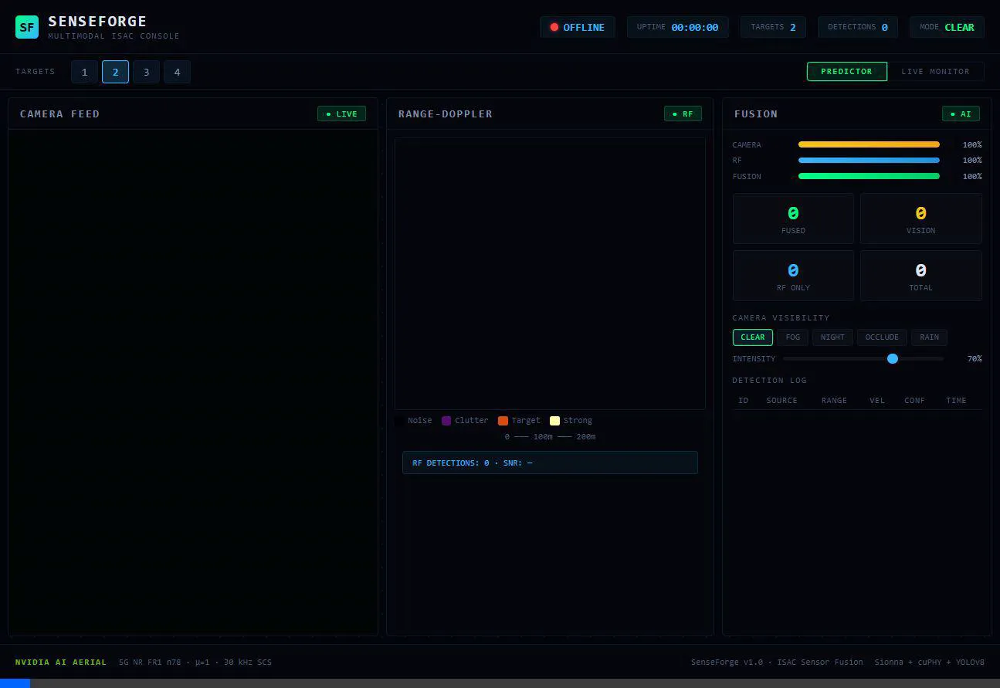

<div align="center">

# 🛡️ SenseForge

### Multimodal ISAC Sensor Fusion System

**5G NR Radar Sensing + Computer Vision | Powered by NVIDIA AI Aerial SDK**

[](https://python.org)
[](https://developer.nvidia.com/aerial-sdk)
[](https://nvlabs.github.io/sionna/)
[](https://react.dev)
[](https://fastapi.tiangolo.com)
[](LICENSE)

*Production-grade ISAC (Integrated Sensing and Communications) system that fuses 5G NR FR1 radar sensing with YOLOv8 computer vision — replicating the architecture demonstrated by NVIDIA and Booz Allen Hamilton at GTC Washington D.C. 2025.*

---



**▲ Live Dashboard** — Camera Feed (left), Range-Doppler Heatmap (center), Fusion Panel (right)

</div>

---

## 📋 Table of Contents

- [Overview](#-overview)
- [Key Demo: ISAC Value Proposition](#-key-demo-isac-value-proposition)
- [Architecture](#-architecture)
- [Screenshots & Recordings](#-screenshots--recordings)
- [Tech Stack](#-tech-stack)
- [Project Structure](#-project-structure)
- [Quick Start](#-quick-start)
- [NVIDIA AI Aerial SDK Setup](#-nvidia-ai-aerial-sdk-setup)
- [Configuration](#-configuration)
- [API Reference](#-api-reference)
- [Testing](#-testing)
- [Docker Deployment](#-docker-deployment)
- [3GPP Validation](#-3gpp-validation)
- [Contributing](#-contributing)
- [License](#-license)
- [Acknowledgments](#-acknowledgments)

---

## 🔭 Overview

**SenseForge** is a full-stack multimodal sensor fusion system that demonstrates how **5G NR OFDM waveforms** can serve a dual purpose — communications **and** radar sensing — within a single integrated pipeline. This is the core concept behind **ISAC (Integrated Sensing and Communications)**, a key feature of 5G-Advanced and 6G networks.

### Why ISAC?

Traditional surveillance relies entirely on cameras, which fail in:
- 🌫️ **Fog** — visibility drops to near zero
- 🌙 **Night** — insufficient lighting for visual detection
- 🧱 **Occlusion** — physical obstructions block line of sight
- 🌧️ **Rain** — lens distortion and reduced contrast

**5G NR radar operates at 3.5 GHz (n78 band)** and is unaffected by these conditions. SenseForge fuses both modalities — when cameras degrade, the RF pipeline maintains full situational awareness.

### Core Capabilities

| Capability | Implementation |
|---|---|
| **OFDM Waveform Generation** | 5G NR FR1 n78, μ=1, 30 kHz SCS, 272 subcarriers |
| **Radar Echo Simulation** | Sionna CDL channel + Friis path loss + Rician fading |
| **Range-Doppler Processing** | LS channel estimation → ECA clutter removal → 2D CA-CFAR |
| **Computer Vision** | YOLOv8 person detection + ByteTrack-style tracking |
| **Depth Estimation** | MiDaS monocular depth (with heuristic fallback) |
| **Weather Degradation** | Fog, Night, Occlusion, Rain simulation at variable intensity |
| **AI Fusion** | 14-input MLP with source-aware weighted averaging |
| **Real-time Dashboard** | 3-panel military-grade UI with WebSocket streaming |

---

## 🎯 Key Demo: ISAC Value Proposition

The critical demonstration shows SenseForge's resilience when camera feeds degrade. The RF radar continues to detect and track targets, proving the value of integrated sensing.

### Clear Mode → Fog Mode → Night Mode

<div align="center">

| Clear Mode (100% Camera) | Fog Mode (37% Camera) | Night Mode (34% Camera) |
|:---:|:---:|:---:|
|  |  |  |
| Camera + RF both active | Camera degraded, RF persists | Near-blind camera, RF unaffected |
| Green **FUS** + Yellow **VIS** + Blue **RF** | Green **FUS** dominant, Blue **RF** backup | Green **FUS** + Blue **RF ONLY** |

</div>

### What Happens During Degradation

```
CLEAR MODE                    FOG/NIGHT MODE
┌────────────────┐            ┌────────────────┐
│ 📷 Camera: 100% │           │ 📷 Camera: 37%  │  ← Degraded
│ 📡 RF:     100% │           │ 📡 RF:     100% │  ← Unaffected!
│                │            │                │
│ Vision: ██████ │            │ Vision: ██     │  ← Drops
│ RF:     ██████ │            │ RF:     ██████ │  ← Stable
│ Fused:  ██████ │            │ Fused:  ██████ │  ← RF compensates
│                │            │                │
│ Source: FUSED  │            │ Source: RF_ONLY │  ← Label changes
└────────────────┘            └────────────────┘
```

> **The ISAC argument**: When you click **FOG** or **NIGHT**, the camera confidence drops (visible in the gauge bar), vision detections disappear, but blue **RF ONLY** labels appear on all tracked targets. The 5G NR radar maintains full track continuity.

### 🎬 Live Demo Recording

<div align="center">


*▲ Automated degradation cycle: Clear → Fog → Night → Clear*
</div>

---

## 🏗️ Architecture

```
┌─────────────────────────────────────────────────────────────────────────┐
│                        SenseForge ISAC System                          │
├─────────────┬─────────────┬──────────────┬──────────────┬──────────────┤
│  LAYER 1    │  LAYER 2    │   LAYER 3    │   LAYER 4    │   LAYER 5   │
│  RF Radar   │  Vision     │   Fusion     │   Backend    │   Frontend  │
│             │             │              │              │             │
│ ┌─────────┐ │ ┌─────────┐ │ ┌──────────┐ │ ┌──────────┐ │ ┌─────────┐ │
│ │Waveform │ │ │ YOLOv8  │ │ │ Feature  │ │ │ FastAPI  │ │ │  React  │ │
│ │  Gen    │ │ │Detector │ │ │  Vector  │ │ │  REST +  │ │ │Dashboard│ │
│ ├─────────┤ │ ├─────────┤ │ │  Build   │ │ │WebSocket │ │ ├─────────┤ │
│ │  Echo   │ │ │ByteTrack│ │ ├──────────┤ │ ├──────────┤ │ │ Camera  │ │
│ │Simulator│ │ │ Tracker │ │ │   MLP    │ │ │ /ws/video│ │ │  Feed   │ │
│ ├─────────┤ │ ├─────────┤ │ │14→64→32→4│ │ │ /ws/radar│ │ ├─────────┤ │
│ │Range-   │ │ │  MiDaS  │ │ ├──────────┤ │ │ /ws/det  │ │ │ Radar   │ │
│ │Doppler  │ │ │  Depth  │ │ │ Weighted │ │ ├──────────┤ │ │Heatmap  │ │
│ │  Map    │ │ ├─────────┤ │ │  Fuse    │ │ │ /health  │ │ ├─────────┤ │
│ ├─────────┤ │ │Degrader │ │ │ (source  │ │ │ /scenario│ │ │ Fusion  │ │
│ │ Kalman  │ │ │Fog/Night│ │ │  aware)  │ │ │ /degrade │ │ │  Panel  │ │
│ │ Tracker │ │ │Occ/Rain │ │ │          │ │ │          │ │ │         │ │
│ └─────────┘ │ └─────────┘ │ └──────────┘ │ └──────────┘ │ └─────────┘ │
├─────────────┴─────────────┴──────────────┴──────────────┴──────────────┤
│                   NVIDIA AI Aerial SDK (pyAerial + Sionna)              │
│                   cuPHY PUSCH Decoder · CDL Channel Model               │
└─────────────────────────────────────────────────────────────────────────┘
```

### Data Flow

```
5G NR Waveform ──► Echo Simulation ──► Range-Doppler ──► CFAR ──► RF Tracks ──┐
                                                                               ├──► Fusion MLP ──► Dashboard
Camera Frame ──► YOLOv8 ──► ByteTrack ──► Depth ──► Vision Tracks ────────────┘
                    │
                    ▼
              Degradation (Fog/Night/Occlusion/Rain)
```

---

## 📸 Screenshots & Recordings

### Dashboard — Initial State (Backend Offline)

<div align="center">


*▲ Dashboard before backend connection — showing UI structure with "Awaiting" placeholders*
</div>

### Dashboard — Live with Backend

<div align="center">


*▲ Live dashboard receiving streaming data via 3 WebSocket connections*
</div>

### Backend Health Endpoint

<div align="center">


*▲ `/health` endpoint showing pipeline status, target count, and uptime*
</div>

### Dashboard Preview Recording

<div align="center">


*▲ Browser recording of initial dashboard load and interaction*
</div>

---

## 🛠️ Tech Stack

<table>
<tr>
<td><b>Layer</b></td>
<td><b>Technology</b></td>
<td><b>Purpose</b></td>
</tr>
<tr>
<td rowspan="3">RF Pipeline</td>
<td>NVIDIA AI Aerial SDK (pyAerial)</td>
<td>cuPHY PUSCH decoding, GPU-accelerated PHY</td>
</tr>
<tr>
<td>Sionna (≥ 0.18)</td>
<td>CDL channel models, ResourceGrid, OFDM</td>
</tr>
<tr>
<td>NumPy / SciPy</td>
<td>Range-Doppler FFT, CA-CFAR, Kalman filter</td>
</tr>
<tr>
<td rowspan="3">Vision Pipeline</td>
<td>YOLOv8 (Ultralytics)</td>
<td>Real-time person detection</td>
</tr>
<tr>
<td>MiDaS (Intel ISL)</td>
<td>Monocular depth estimation</td>
</tr>
<tr>
<td>OpenCV</td>
<td>Frame processing, degradation effects</td>
</tr>
<tr>
<td>Fusion</td>
<td>PyTorch</td>
<td>14-input MLP with source-aware fusion</td>
</tr>
<tr>
<td>Backend</td>
<td>FastAPI + Uvicorn</td>
<td>REST API + 3 WebSocket streams</td>
</tr>
<tr>
<td>Frontend</td>
<td>React 18 + Canvas API</td>
<td>Military-grade dashboard with IBM Plex Mono</td>
</tr>
<tr>
<td>Deployment</td>
<td>Docker + NVIDIA Container Toolkit</td>
<td>GPU-accelerated containerised deployment</td>
</tr>
</table>

---

## 📁 Project Structure

```
SenseForge/
├── rf/                          # Layer 1: RF Radar Pipeline
│   ├── __init__.py
│   ├── waveform_gen.py          # 5G NR FR1 n78 OFDM waveform generator
│   ├── echo_simulator.py        # Sionna CDL channel + Friis path loss
│   ├── range_doppler.py         # LS estimation → ECA → CA-CFAR → NMS
│   └── rf_tracker.py            # Kalman filter with NN association
│
├── vision/                      # Layer 2: Computer Vision Pipeline
│   ├── __init__.py
│   ├── detector.py              # YOLOv8 person detector (+ synthetic fallback)
│   ├── tracker.py               # ByteTrack-style Hungarian matching
│   ├── depth.py                 # MiDaS monocular depth estimation
│   └── degradation.py           # Fog / Night / Occlusion / Rain simulator
│
├── fusion/                      # Layer 3: AI Fusion Engine
│   ├── __init__.py
│   ├── model.py                 # FusionMLP (14→64→32→4) + weighted fuse()
│   └── train.py                 # Synthetic data generator + training loop
│
├── backend/                     # Layer 4: API & Streaming
│   ├── __init__.py
│   └── main.py                  # FastAPI + 3 WebSockets + background threads
│
├── frontend/                    # Layer 5: React Dashboard
│   ├── public/
│   │   └── index.html           # IBM Plex Mono shell
│   ├── src/
│   │   ├── App.js               # Main app with WebSocket state management
│   │   ├── App.css              # Defence-grade design system
│   │   ├── CameraFeed.js        # Canvas camera with corner-bracket boxes
│   │   ├── RadarHeatmap.js      # INFERNO colormap heatmap
│   │   ├── FusionPanel.js       # Gauges, counts, degradation controls
│   │   ├── index.js             # React entry point
│   │   └── index.css            # Global styles
│   ├── package.json
│   └── .env
│
├── scripts/
│   ├── demo_generator.py        # Synthetic video generator (OpenCV)
│   └── record_demo.py           # WebSocket demo recorder
│
├── tests/                       # 95 total tests
│   ├── test_rf_pipeline.py      # 32 RF tests
│   ├── test_vision_pipeline.py  # 35 vision tests
│   └── test_fusion.py           # 28 fusion tests
│
├── docs/
│   └── images/                  # Screenshots and recordings
│
├── models/                      # Trained model weights
│   └── fusion_model.pt
│
├── run_pipeline_test.py         # 15 E2E checks with ANSI output
├── aerial_validate.py           # 3GPP TS 38.211 constraint validation
├── aerial_setup.sh              # NVIDIA Aerial SDK setup automation
├── build.sh                     # Build + train script
│
├── docker-compose.yml           # GPU backend + nginx frontend
├── Dockerfile.backend           # Aerial container-based backend
├── Dockerfile.frontend          # Multi-stage React + nginx
├── nginx.conf                   # SPA routing + WS proxy
│
├── requirements.txt             # Python dependencies
├── pytest.ini                   # Test configuration
├── render.yaml                  # Render.com deployment
├── Procfile                     # Heroku/Railway deployment
└── .gitignore
```

---

## 🚀 Quick Start

### Prerequisites

- Python 3.11+
- Node.js 18+
- (Optional) NVIDIA GPU + CUDA 12.x for SDK mode
- (Optional) NVIDIA AI Aerial SDK + Sionna for full RF pipeline

### 1. Clone & Install

```bash
git clone https://github.com/yourusername/SenseForge.git
cd SenseForge

# Python dependencies
pip install -r requirements.txt

# Frontend dependencies
cd frontend && npm install && cd ..
```

### 2. Train the Fusion Model

```bash
python -m fusion.train
# Output: models/fusion_model.pt (trains in ~7 seconds)
```

### 3. Start the Backend

```bash
python -m uvicorn backend.main:app --host 0.0.0.0 --port 8000
```

### 4. Start the Frontend

```bash
cd frontend
npm start
# Dashboard available at http://localhost:3000
```

### 5. Open the Dashboard

Navigate to **http://localhost:3000** — you'll see:
- 📷 Live camera feed with animated detection boxes
- 📡 INFERNO-colormap range-Doppler heatmap
- 🧠 Real-time fusion gauges and detection log

---

## 🔧 NVIDIA AI Aerial SDK Setup

For full GPU-accelerated RF processing with cuPHY PUSCH decoding:

```bash
# Automated setup (requires Docker + NVIDIA drivers)
bash aerial_setup.sh
```

This script will:
1. ✅ Check prerequisites (Docker, Git LFS, nvidia-smi)
2. ✅ Verify NVIDIA Docker runtime
3. ✅ Clone `aerial-cuda-accelerated-ran` repository
4. ✅ Pull NGC Aerial container image
5. ✅ Start container with project + pyAerial mounted
6. ✅ Install dependencies, train model, and start backend

### Manual Setup

```bash
# 1. Clone Aerial SDK
git clone --recurse-submodules https://github.com/NVIDIA/aerial-cuda-accelerated-ran.git ~/aerial

# 2. Install pyAerial
pip install -e ~/aerial/pyaerial/

# 3. Install Sionna
pip install sionna>=0.18.0

# 4. Validate
python aerial_validate.py
```

> **Note**: Without the Aerial SDK, SenseForge runs in **Synthetic Mode** — all pipeline stages use simulated data. The dashboard and fusion logic work identically.

---

## ⚙️ Configuration

### Waveform Parameters (5G NR FR1 n78)

| Parameter | Value | 3GPP Reference |
|---|---|---|
| Band | n78 (3.3 – 3.8 GHz) | TS 38.104 |
| Carrier Frequency | 3.5 GHz | |
| Subcarrier Spacing | 30 kHz (μ=1) | TS 38.211 |
| Subcarriers | 272 | |
| OFDM Symbols/Slot | 14 (Normal CP) | TS 38.211 §5.2.1 |
| FFT Size | 512 | |
| Bandwidth | 8.16 MHz | |
| MCS Index | 16 (64-QAM, R=0.48) | TS 38.214 Table 5.1.3.1-1 |

### Radar Performance

| Parameter | Value |
|---|---|
| Range Resolution | ~18.4 m |
| Max Range | ~5,000 m |
| Velocity Resolution | ~0.61 m/s |
| Max Velocity | ~4.29 m/s |
| CFAR false alarm rate | 10⁻⁴ |

### Environment Variables

| Variable | Default | Description |
|---|---|---|
| `FRONTEND_URL` | `http://localhost:3000` | CORS origin for backend |
| `REACT_APP_BACKEND_URL` | `http://localhost:8000` | Backend URL for frontend |
| `REACT_APP_WS_URL` | `ws://localhost:8000` | WebSocket URL |

---

## 📡 API Reference

### REST Endpoints

| Method | Endpoint | Description |
|---|---|---|
| `GET` | `/health` | System status, uptime, pipeline state |
| `POST` | `/scenario` | Set target count and scenario seed |
| `POST` | `/degrade` | Set camera degradation mode and intensity |

### WebSocket Streams

| Endpoint | Rate | Payload |
|---|---|---|
| `/ws/video` | ~15 Hz | `{ frame: <base64 JPEG> }` |
| `/ws/radar` | ~10 Hz | `{ rd_matrix: [[...]], detections: [...] }` |
| `/ws/detections` | ~5 Hz | `{ detections: [...], mode, camera_confidence, rf_confidence }` |

### Example: POST `/degrade`

```bash
curl -X POST http://localhost:8000/degrade \
  -H "Content-Type: application/json" \
  -d '{"mode": "fog", "intensity": 0.8}'
```

Response:
```json
{
  "mode": "fog",
  "intensity": 0.8,
  "camera_confidence": 0.24
}
```

---

## 🧪 Testing

### Run All Tests (95 tests)

```bash
pytest tests/ -v
```

### Run End-to-End Pipeline Validation (15 checks)

```bash
python run_pipeline_test.py
```

```
══════════════════════════════════════════════════════
  SenseForge — End-to-End Pipeline Validation
══════════════════════════════════════════════════════

  RF Pipeline
  ──────────────────────────────────────────────
  ✓ PASS  WaveformConfig parameters
  ✓ PASS  WaveformConfig derived properties
  ✓ PASS  Target physics (RCS, Doppler, delay)
  ✓ PASS  Scenario generator
  ✓ PASS  Channel estimation
  ✓ PASS  Range-Doppler map computation
  ✓ PASS  CFAR detection
  ✓ PASS  RF Kalman tracker

  Vision Pipeline
  ──────────────────────────────────────────────
  ✓ PASS  Degradation modes (all 5)
  ✓ PASS  YOLO detector (synthetic)
  ✓ PASS  Vision tracker + IoU
  ✓ PASS  Depth estimation (heuristic)

  Fusion Layer
  ──────────────────────────────────────────────
  ✓ PASS  Feature vector normalisation
  ✓ PASS  Fusion source labelling (all 4 branches)
  ✓ PASS  Training data generator

══════════════════════════════════════════════════════
  15 PASSED  /  0 FAILED
  ALL CHECKS PASSED ✓
══════════════════════════════════════════════════════
```

### Run 3GPP Validation

```bash
python aerial_validate.py
```

---

## 🐳 Docker Deployment

### Full GPU Deployment

```bash
# Set environment
export AERIAL_SDK_PATH=~/aerial-cuda-accelerated-ran
export AERIAL_IMAGE=nvcr.io/nvidia/aerial/aerial-cuda-accelerated-ran:25-3-cubb

# Launch
docker-compose up -d
```

This starts:
- **Backend** on port `8000` (GPU-enabled Aerial container)
- **Frontend** on port `3000` (nginx serving React build)

### Frontend Only (for development)

```bash
docker build -f Dockerfile.frontend -t senseforge-frontend .
docker run -p 3000:3000 senseforge-frontend
```

---

## 📏 3GPP Validation

SenseForge validates all waveform parameters against **3GPP TS 38.211** constraints:

```
═══════════════════════════════════════════════════════
  SenseForge — 3GPP TS 38.211 Validation
═══════════════════════════════════════════════════════

  ✓ SCS valid for FR1: 30000 (expected: one of [15000, 30000, 60000])
  ✓ Carrier frequency in FR1: 3500000000.0 (expected: 410e6 <= fc <= 7.125e9)
  ✓ Carrier in n78 band: 3500000000.0 (expected: 3.3e9 <= fc <= 3.8e9)
  ✓ Numerology μ: 1 (expected: 1)
  ✓ OFDM symbols per slot: 14 (expected: 14)
  ✓ FFT size is power of 2: 512 (expected: power of 2)
  ✓ FFT size >= num_subcarriers: 512 (expected: >= 272)
  ✓ MCS index valid: 16 (expected: 0 <= mcs <= 28)
  ✓ Range resolution > 0: 18.38 m
  ✓ Max range > 100m: 4997 m

  Result: 12/12 passed ✓
```

---

## 🤝 Contributing

1. Fork the repository
2. Create a feature branch (`git checkout -b feature/amazing-feature`)
3. Commit your changes (`git commit -m 'Add amazing feature'`)
4. Push to the branch (`git push origin feature/amazing-feature`)
5. Open a Pull Request

---

## 📄 License

This project is licensed under the MIT License — see the [LICENSE](LICENSE) file for details.

---

## 🙏 Acknowledgments

- **[NVIDIA AI Aerial SDK](https://developer.nvidia.com/aerial-sdk)** — GPU-accelerated 5G PHY layer processing
- **[Sionna](https://nvlabs.github.io/sionna/)** — Open-source link-level simulator by NVIDIA
- **[NVIDIA & Booz Allen Hamilton](https://www.nvidia.com/gtc/)** — Original ISAC demonstration at GTC Washington D.C. 2025
- **[Ultralytics YOLOv8](https://docs.ultralytics.com/)** — State-of-the-art object detection
- **[MiDaS](https://github.com/isl-org/MiDaS)** — Intel ISL monocular depth estimation

---

<div align="center">

**Built with 🛡️ by the SenseForge Team**

*5G NR FR1 n78 · μ=1 · 30 kHz SCS · Sionna + cuPHY + YOLOv8*

<br/>


</div>
